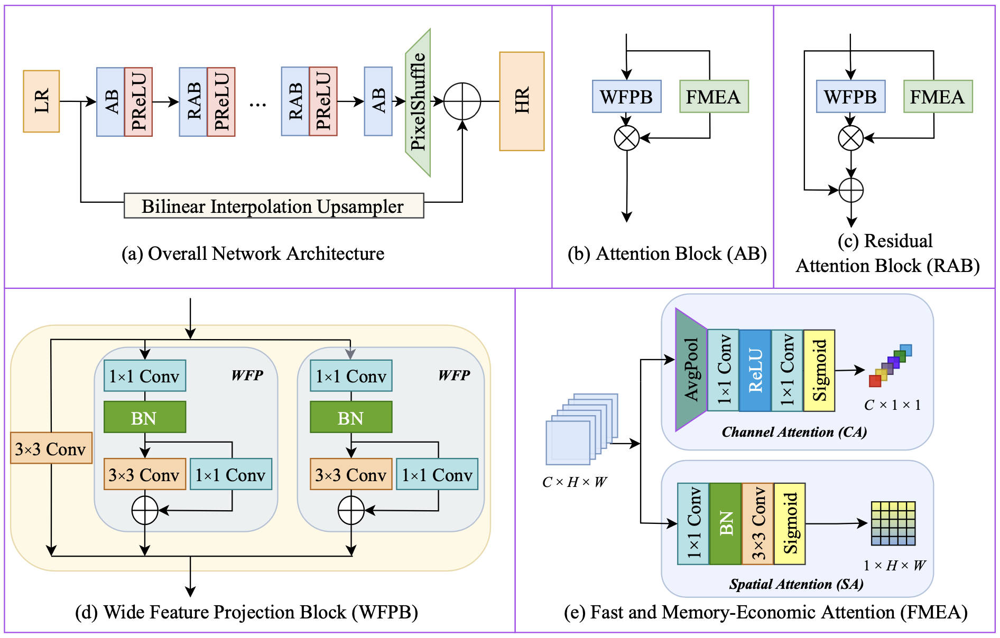
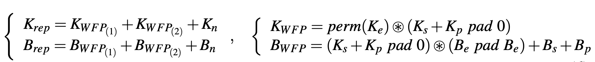
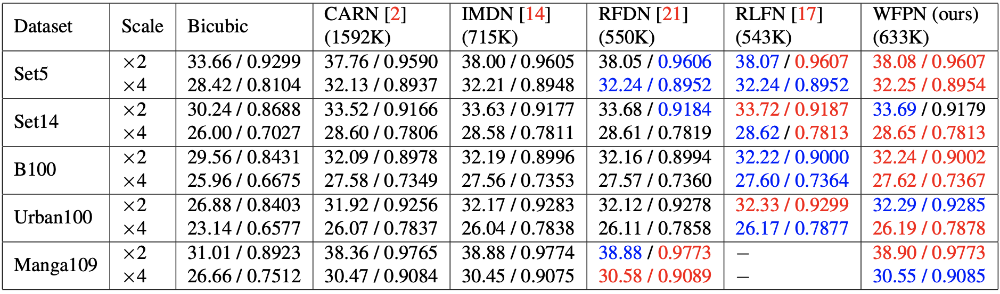
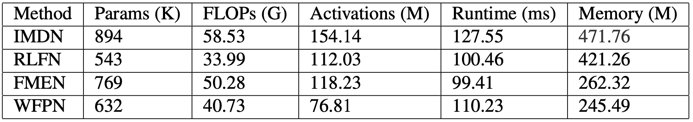
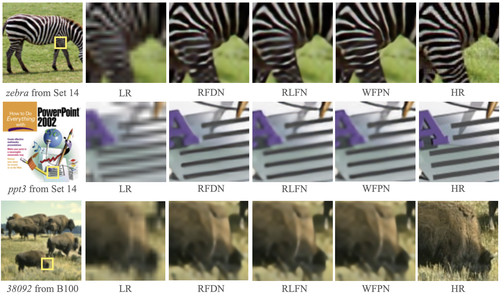

<div align="center">

## [BMVC 2022] [Wide Feature Projection with Fast and Memory-Economic Attention for Efficient Image Super-Resolution](https://bmvc2022.mpi-inf.mpg.de/0615.pdf)

**Minghao Fu**, Dongyang Zhang, Min Lei, Kun He, Changyu Li, Jie Shao

<p align="center">
    
</p>
<p align="center">
Figure 1: Network architecture of the proposed Wide Feature Projection Network (WFPN). 
</p>

</div>

## Environment

This code is tested on Ubuntu 16.04.6 LTS environment (Python 3.7.11, Pytorch 1.7.1, CUDA 9.0, cuDNN 7.0.5) with TITAN RTX GPU.

## Dataset
- [DIV2K](https://data.vision.ee.ethz.ch/cvl/DIV2K/)
- [Flickr2K](http://cv.snu.ac.kr/research/EDSR/Flickr2K.tar) 

## Get Started

Prepare the environment:
```bash
conda create --name WFPN python=3.7 -y
conda activate WFPN

git clone https://github.com/MinghaoFu/WFPN.git
cd WFPN

pip install -r requirements.txt
```

## Configs

Basic training and testing configs could be adjusted in ```./configs/plain.json```

For specifc model, you could customize it in ```./configs/{model}.json```

## Main Results

<p align="center">
  
</p>
<p align="center">
  Equation 6: Explain how to represent WFP by merging different convolution kernels. 
</p>

<p align="center">
  
</p>
<p align="center">
Table 2: Performance comparison on benchmark datasets. Number of model parameters is computed on ×4 task. Red indicates the best and blue indicates the second best. 
</p>

<p align="center">
  
</p>
<p align="center">
Figure 2: Visual results on Set14 and B100 for ×4 upscaling.
</p>

<p align="center">
  
</p>
<p align="center">
Table 3: Efficiency comparison for ×4 upscaling.
</p>

## License

This repository is licensed under the terms of the MIT license.

*Your star is my motivation to update, thanks!*

## Citation

If you find our work useful in your research or publication, please cite our work:

```bash
@inproceedings{DBLP:conf/bmvc/FuZLHLS22,
  author       = {Minghao Fu and
                  Dongyang Zhang and
                  Min Lei and
                  Kun He and
                  Changyu Li and
                  Jie Shao},
  title        = {Wide Feature Projection with Fast and Memory-Economic Attention for
                  Efficient Image Super-Resolution},
  booktitle    = {33rd British Machine Vision Conference 2022, {BMVC} 2022, London,
                  UK, November 21-24, 2022},
  year         = {2022},
}
```
